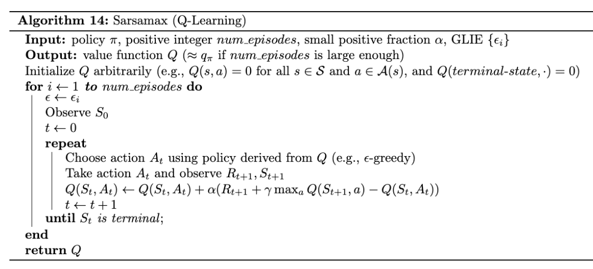
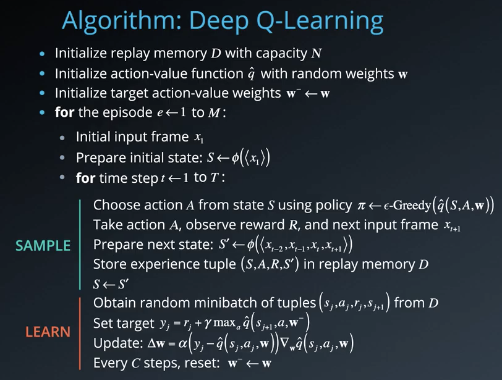
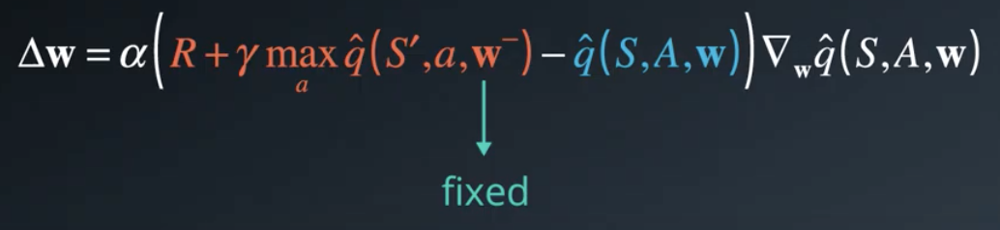
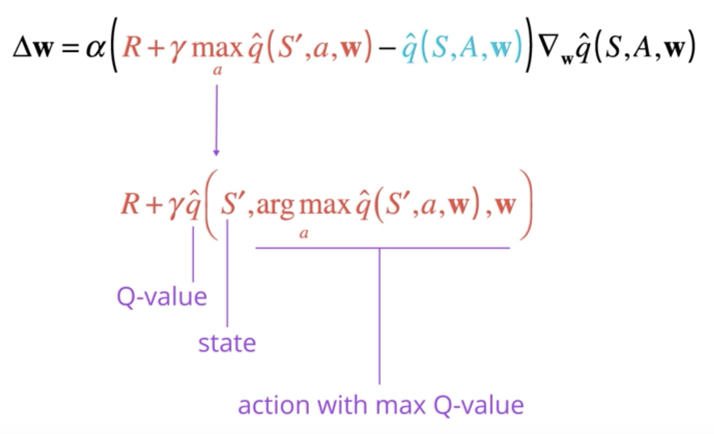
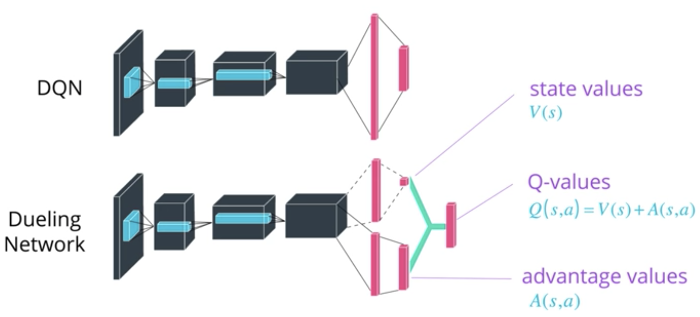
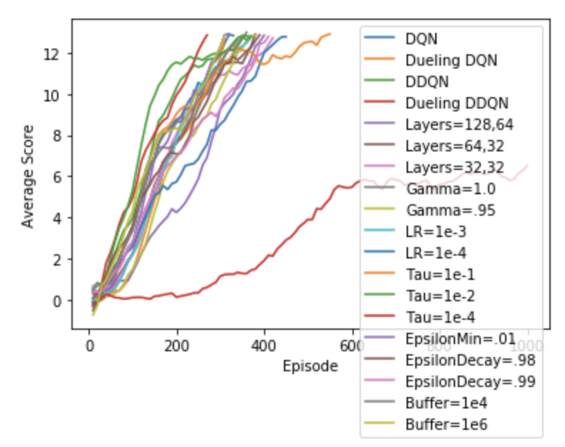

### Goal

A reward of +1 is provided for collecting a yellow banana, and a reward of -1 is provided for collecting a blue banana.  Thus, the goal of your agent is to collect as many yellow bananas as possible while avoiding blue bananas.  The task is episodic, and in order to solve the environment, your agent must get an average score of +13 over 100 consecutive episodes.

### State and Action Space

The state space has 37 dimensions and contains the agent's velocity, along with ray-based perception of objects around agent's forward direction.  Given this information, the agent has to learn how to best select actions.  Four discrete actions are available, corresponding to:

- **`0`** - move forward.
- **`1`** - move backward.
- **`2`** - turn left.
- **`3`** - turn right.

### Establish Baseline

To establish a baseline, I first see how the agent performs using the equiprobable random policy.  I ran this code a few times, resulting in scores of -2 to 2. Of course, we'll want to do better by training our agent to learn from these experiences.

```
env_info = env.reset(train_mode=False)[brain_name] # reset the environment
state = env_info.vector_observations[0]            # get the current state
score = 0                                          # initialize the score
while True:
    action = np.random.randint(action_size)        # select an action
    env_info = env.step(action)[brain_name]        # send the action to the environment
    next_state = env_info.vector_observations[0]   # get the next state
    reward = env_info.rewards[0]                   # get the reward
    done = env_info.local_done[0]                  # see if episode has finished
    score += reward                                # update the score
    state = next_state                             # roll over the state to next time step
    if done:                                       # exit loop if episode finished
        break
    
print("Score: {}".format(score))
```

### Learning Algorithm & Architecture 

The objective of the learning algorithm is to learn the optimal policy (π*) — the policy that maximizes long term reward.  To achieve this, I use an extension of Q-Learning.  Q-Learning learns the actual-value function: How good to take an action at a given state.



#### DQN

Because our environment has a continous state space, I needed to extend the basic Q-Learning implimentation, replacing the Q-Table with a deep neural network.  This allows the action-value function to generalize to unseen states, however further improvements to improve learning stability. These improvements come from the [DQN paper](https://www.cs.toronto.edu/~vmnih/docs/dqn.pdf).



##### Experience Replay

The basic Q-learning algorithm learns from each experience in sequential order, running the risk of being swayed by the correlation of those experiences. In addition, since we are throwing away each experience after learning from it, we are potentially not learning as much as we could from it.

With experience replay, we store each experience experience tuples (S, A, R, S′) in a buffer.  During the learning phase, experience tuples are sampled at random, breaking the harmful correlation effects learned from sequential ordering.  Another great side effect of storing experience tuples in memory is that we get to leverage traditional supervised learning techniques.

##### Fixed Q-Targets

Fixed Q-Targets improve stability by de-coupling the target from our current estimate.  Without fixed Q-targets we update the parameters of the network based on a constantly moving target.  Slowly updating a target network allows us to have a target network that is different enough to stabilize learning.




#### Double DQN

DQN is prone to overestimation of Q-values.  When updating network parameters, the target value is obtained through an argmax of the action-values using the current network parameters.  However, since the parameters are still evolving, we likely do not have enough information to know the best action, especially during early stages.  To mitigate this, the Double DQN algorithm introduces a way to validate that we indeed have the best action by evaluating the action value with a second set of parameteres.  In the case where the second network produces a low q-value, then we avoid overestimating the q-value for the given action.  In practice, we already have a second set of weights as introduced with the fixed q-targets.




#### Dueling DQN

From the [Dueling DQN Paper](https://arxiv.org/pdf/1511.06581.pdf)

> The main benefit of this factoring is to generalize learning across actions without imposing any change to the underlying reinforcement learning algorithm. Our results show that this architecture leads to better policy evaluation in the presence of many similar-valued actions.

> Intuitively, the dueling architecture can learn which states are (or are not) valuable, without having to learn the effect of each action for each state

Dueling DQN is achieved by using two streams in the final layers of the network.  One stream estimates the value function, and the other stream estimates the advantage of each action.




### Architecture Results

Next I explore different network architectures and hyperparameters to find an agent that learns the environment efficiently. Because of the time required to test each agent, I do not try all the combinations of each parameter, but instead evaluate each parameter while leaving the rest set to the the defaults. I also quit as soon as the environment is solved, so it is possible that some of these parameters work well early on but do not do as well if allowed to train longer.


| Architecture | Experience Replay | Fixed Q-Targets | Dueling DQN      | DDQN       | Hidden Layers | Episodes to Solve |
| ------------ |------------------ | --------------- | ---------------- | -----------| --------------| ----------------- |
| DQN          | YES               | YES             | NO               | NO         | 64, 64        | 336               |
| Dueling DQN  | YES               | YES             | **YES**          | NO         | 64, 64        | 316               |
| Double DQN   | YES               | YES             | NO               | **YES**    | 64, 64        | 379               |
| Dueling DDQN | YES               | YES             | **YES**          | **YES**    | 64, 64        | 273               |
| DQN          | YES               | YES             | NO               | NO         | **128, 64**   | 406               |
| DQN          | YES               | YES             | NO               | NO         | **64, 32**    | 383               |
| DQN          | YES               | YES             | NO               | NO         | **32, 32**    | 425               |

### Hyperparameter Results

| Architecture | Gamma         | Learning Rate | Tau        | Buffer Size | Epsilon Decay | Epsilon Min | Episodes to Solve |
| ------------ |-------------- | ------------- | -----------| ----------- | ------------- | ----------- | ----------------- |
| DQN          | 0.99          | 0.0005        | 0.001      | 1e5         | 0.97          | 0.2         | 336               |
| DQN          | **1.0**       | 0.0005        | 0.001      | 1e5         | 0.97          | 0.2         | 362               |
| DQN          | **0.95**      | 0.0005        | 0.001      | 1e5         | 0.97          | 0.2         | 385               |
| DQN          | 0.99          | **0.001**     | 0.001      | 1e5         | 0.97          | 0.2         | 375               |
| DQN          | 0.99          | **0.0001**    | 0.001      | 1e5         | 0.97          | 0.2         | 459               |
| DQN          | 0.99          | 0.0005        | **0.1**    | 1e5         | 0.97          | 0.2         | 556               |
| DQN          | 0.99          | 0.0005        | **0.01**   | 1e5         | 0.97          | 0.2         | 379               |
| DQN          | 0.99          | 0.0005        | **0.0001** | 1e5         | 0.97          | 0.2         | x                 |
| DQN          | 0.99          | 0.0005        | 0.001      | **1e4**     | 0.97          | 0.2         | 346               |
| DQN          | 0.99          | 0.0005        | 0.001      | **1e6**     | 0.97          | 0.2         | 312               |
| DQN          | 0.99          | 0.0005        | 0.001      | 1e5         | **0.98**      | 0.2         | 395               |
| DQN          | 0.99          | 0.0005        | 0.001      | 1e5         | **0.99**      | 0.2         | 416               |
| DQN          | 0.99          | 0.0005        | 0.001      | 1e5         | 0.97          | **0.1**     | 322               |




### Final Parameters and Trained Agent

After determining the best parameters from training various networks and hyperparameters, I then trained an agent over a larger number of episodes.  I keep track of the best average score over the past 100 episodes, and save a new checkpoint for each new best value.

| Architecture | Hidden Layers | Gamma | Learning Rate | Tau   | Buffer Size | ε Decay | ε Min  | Episodes to Solve |
| ------------ |---------------| ----- | --------------| ----- | ----------- | ------- | ----- |-------------------|
| Dueling DDQN | 64,64         | 0.99  | 0.0005        | 0.001 | 1e5         | 0.97    | 0.2   | 273               |

```
Training Agent: Dueling DDQN
Episode: 100	Average Score: 4.94
Episode: 200	Average Score: 9.93
Environment solved in 273 episodes!	Average Score: 13.04
```

### Improvement Ideas

- [Prioritized Experience Replay](https://arxiv.org/abs/1511.05952) "In this paper we develop a framework for prioritizing experience, so as to replay important transitions more frequently, and therefore learn more efficiently."
- [A3C](https://arxiv.org/abs/1602.01783) "We present asynchronous variants of four standard reinforcement learning algorithms and show that parallel actor-learners have a stabilizing effect on training..."
- [Noisy DQN](https://arxiv.org/abs/1706.10295).  "We introduce NoisyNet, a deep reinforcement learning agent with parametric noise added to its weights, and show that the induced stochasticity of the agent's policy can be used to aid efficient exploration."
- [Distributed DQN](https://arxiv.org/abs/1707.06887) "In this paper we argue for the fundamental importance of the value distribution: the distribution of the random return received by a reinforcement learning agent. This is in contrast to the common approach to reinforcement learning which models the expectation of this return, or value."
- Try different regularization and activation functions (dropout, relu, tanh)
- To choose the best parameters, allow the agent to learn over a longer period, and not just until the agent solves the environment
- Try more combinations of parameters to find the best network and hyperparameters, as well as try many times to make sure that the performance is consistent.
- Try momentum or decay with learning rate and tau